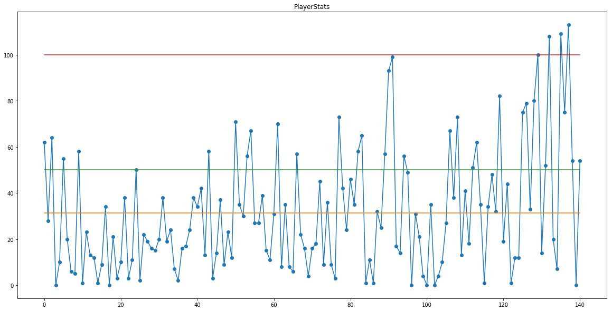
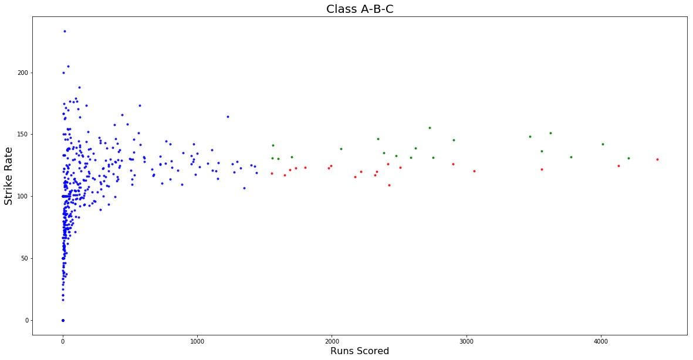
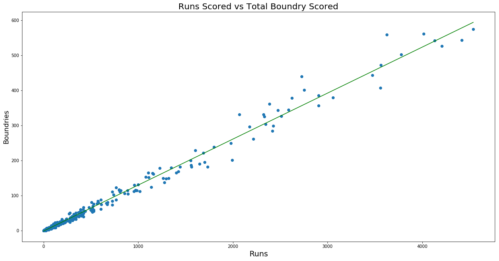

# IPL_Insights
IPL is one of the premier cricket championships pitting players from around the world with each other. In this project, a brief analysis on the batsman and bowler along with the prediction of match results has been done.

## Files
The analytics have been divided into three files: *[IPL - Batsman Analysis.ipynb](https://github.com/Dheeraj1998/IPL_Insights/blob/master/IPL%20-%20Batsman%20Analysis.ipynb)*, *[IPL - Bowler Analysis.ipynb](https://github.com/Dheeraj1998/IPL_Insights/blob/master/IPL%20-%20Bowler%20Analysis.ipynb)* and *[IPL - Match Predictions](https://github.com/Dheeraj1998/IPL_Insights/blob/master/IPL%20-%20Match%20Predictions.ipynb)*.

## Dataset
The IPL dataset has been downloaded from Kaggle and could be found at [this link](https://www.kaggle.com/manasgarg/ipl). The dataset contains two files *deliveries.csv* and *matches.csv*.

## Visual Insights
#### Batsman Performance Graph (V.Kohli)

#### Comparison of Strikerate vs Runs Scored

#### Comparison of Boundries vs Runs

